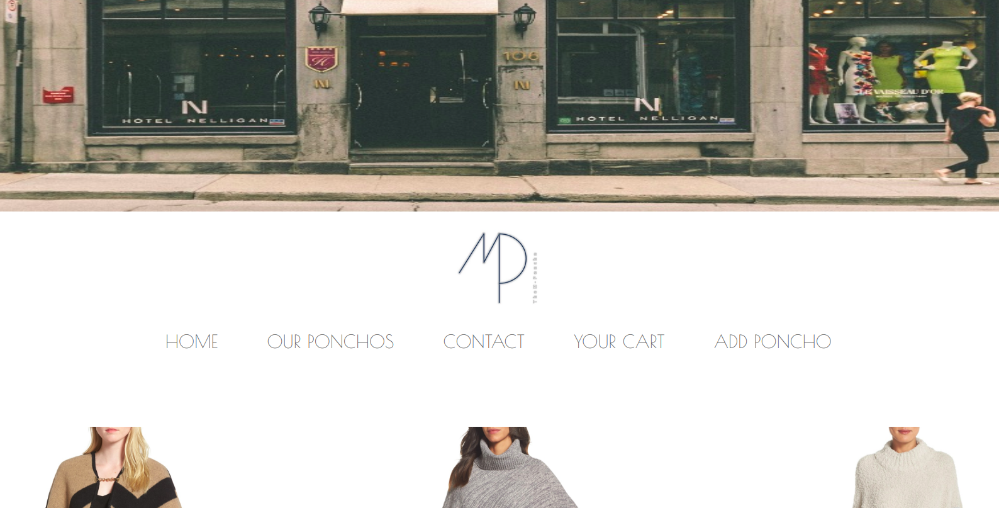

# TheM Poncho

Them Poncho is a mock e-commerce website that showcases mock ponchos. This website will soon be used by my wife to sell ponchos that she makes herself. 

## How To Install

This project was bootstrapped with [Create React App](https://github.com/facebookincubator/create-react-app).

Run `npm install` to install dependencies.

## Serving

Run `npm start` to server locally

## Tech Used

* React
* reactstrap
* React-Stripe-Elements
* Firebase

## Backend repo

[Check out the backend here](https://github.com/michaelmiller2116/maichu-server)
